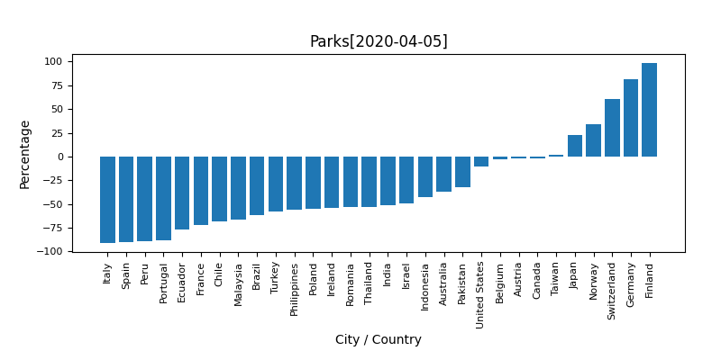

# COVID-19 Google Mobility Reports Comparision

This repository automatically generates a graph listing the rate of increase and decrease for a given city or country from [COVID-19 Community Mobility Reports] (https://www.google.com/covid19/mobility/) provided by Google.
Since the original data is provided as a PDF, we use data automatically extracted from [covid-mobility-data](https://github.com/kylemcdonald/covid-mobility-data) by Kyle Mcdonald.
Due to OCR processing, there is a possibility that the figures presented may contain errors. See Accuracy at [covid-mobility-data](https://github.com/kylemcdonald/covid-mobility-data) for more on that.

# Result
The graph shows the rate of increase and decrease from normal times in percentage terms according to the following items, ranked by country or city. The execution results are each
  * result_image/: each graph image
  * tsvs/: Prefectural data for each item.
and is stored in Please note that the TSV data also includes the rate of increase or decrease for past dates other than the most recent date, so if you want to graph the increase for each date, please use this link.


## Graph for each item (data of March 29, 2020)

* retail & recreation
* Grocery & pharmacy
* parks
* transit stations
* workplace
* Residential





# Requirement
* python(>3.6)
* matplotlib
 
# Getting Started
First, follow the steps in [covid-mobility-data](https://github.com/kylemcdonald/covid-mobility-data) to generate it.
You can then modify the search_name array in compare.py according to the city or country you want to compare.

```bash
git clone https://github.com/TetsuakiBaba/COVID-19-Google-Mobility-Comparision
cd COVID-19-Google-Mobility-Comparision
git clone https://github.com/kylemcdonald/covid-mobility-data.git
cd covid-mobility-data
# then,follow the steps in [covid-mobility-data](https://github.com/kylemcdonald/covid-mobility-data) 
cd ../
python compare.py
```

Then you can find graphs in result_images directory and tsv files in result_tsvs directory.
 
# Note
先に記述したとおりですが、OCR処理によりデータ欠損等が含まれる場合がありますので、その点を十分に理解した上でご利用ください。
 
